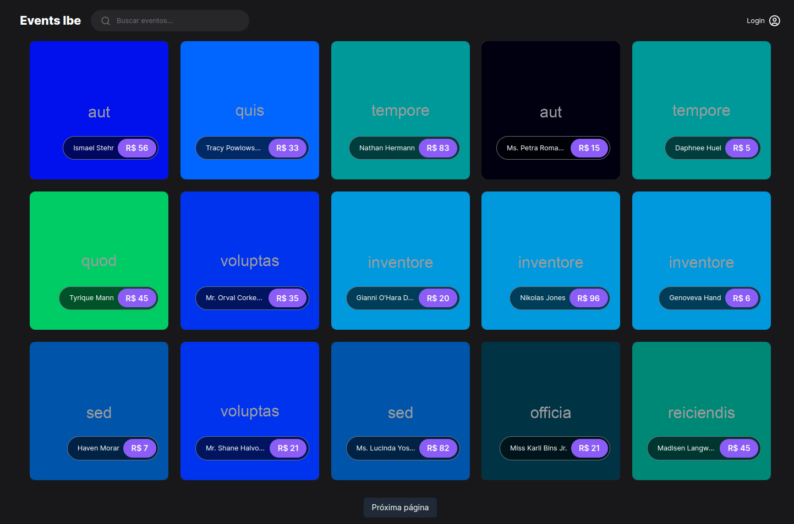
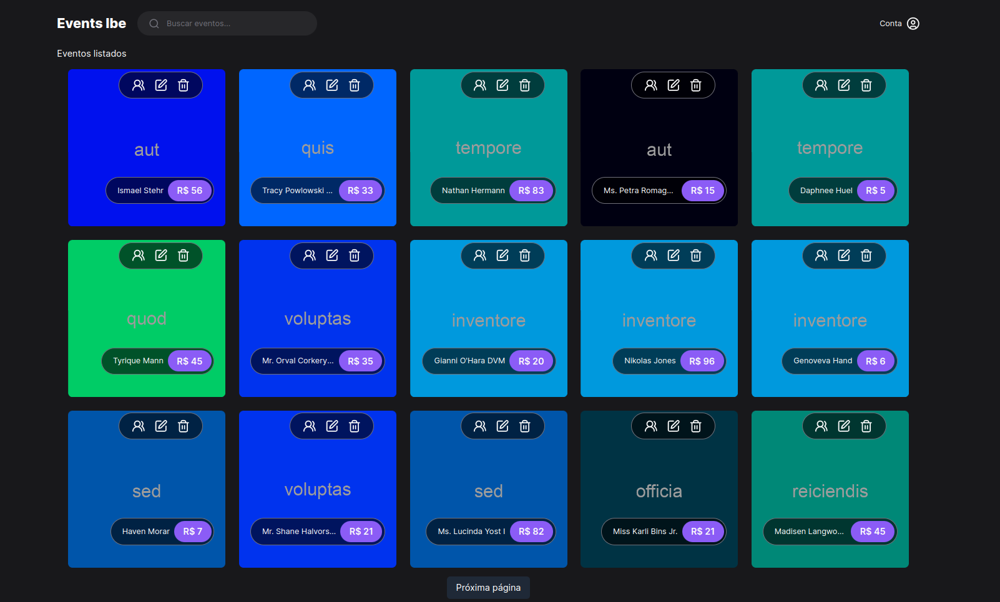
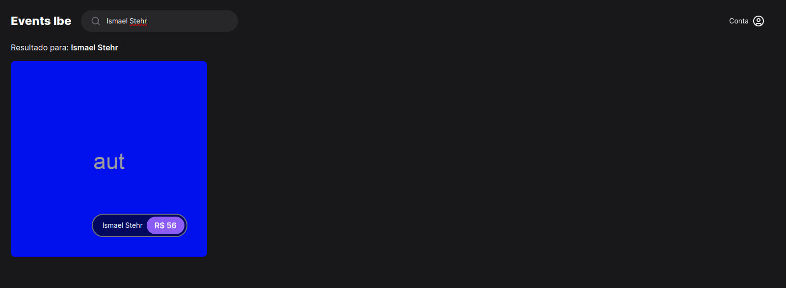
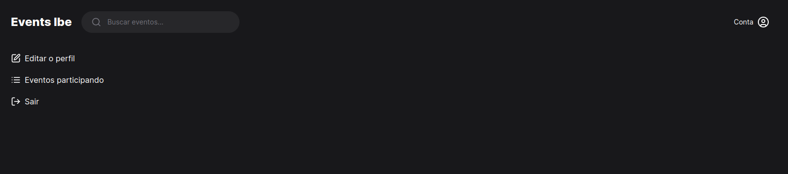

# Sistema de cadastro de evento e participação

O sistema oferece funcionalidades de divulgação de eventos, permitindo que a empresa promova o evento e os clientes se inscrevam, enquanto as vagas vão sendo preenchidas. Além disso, o organizador pode monitorar a participação e acessar a lista de inscritos.

## Requisitos do Sistema

Para operar a API do sistema, são necessários os seguintes requisitos mínimos na sua máquina: PHP, Composer, Docker. O PHP e o Composer são essenciais para executar o Laravel, que contém a API principal do sistema. O Docker é utilizado para virtualizar o ambiente no qual a API é executada. Estes componentes garantem a funcionalidade e o desempenho ideais do nosso sistema de forma integrada e eficiente.

## Requisitos Funcionais
#### RF01. Login de Cliente:
- Informações: permitir que os usuários do aplicativo façam login com seus dados pessoais, e-mail e senha.

#### Regras:
- Cadastro novo Cliente: para criar um novo cadastro de cliente, o cliente deve fornecer um endereço de email e uma senha. Após o cadastro, um email de confirmação será enviado para o endereço de email fornecido, a fim de validar o novo cadastro do cliente.
- Esqueci a senha: o cliente esqueceu sua senha, logo é enviado um e-mail um token.
- Autenticação: O sistema deve verificar se as informações de login do cliente, verificar se já é cadastrado, caso o cliente já esteja cadastrado, mostra mensagem cliente cadastrado, se não houver cadastro daquele cliente segue a rotina normalmente.

#### RF02. Gestão de eventos
Informações: permitir que o usuário (Administrador) da aplicação gerencie eventos que vão acontecer.

#### Regras:
- A aplicação deve permitir que os administradores cadastrem novos eventos;
- A aplicação deve permitir que os administradores desative os eventos que foram inutilizados;
- A aplicação deve permitir que os administradores visualizem todos os eventos;
- A aplicação deve permitir que os administradores alterem o status do evento de acordo com sua disponibilidade, podendo ser "disponível" ou "ocupada";

#### RF03. Menu digital
- Informações: permitir que os usuários da aplicação visualizem eventos disponíveis, com descrições do evento, preços, foto, disponibilidade, localidade, capacidade, data de início e data de encerramento da inscrição.

#### Regras:
- Permitir que os clientes visualizem os eventos de forma digital;
- Fornecer imagens e descrições claras dos eventos;
- Permitir que os clientes façam reserva diretamente na aplicação;
- Permitir que os clientes visualizem os preços do evento e seja atualizado o subtotal do pedido em tempo real, após aumentar o número de entradas.
- Será de fácil utilização, tanto para a clientela quanto para os responsáveis pela gestão do estabelecimento.
- Os eventos designados como indisponíveis na base de dados deverão ficar indisponíveis para fazer a seleção.

## Arquitetura do Sistema

O sistema utiliza as seguintes linguagens:

O sistema utiliza as seguintes tecnologias:

- **Linguagens:** PHP, TypeScript
- **Banco de Dados:** MySQL
- **Frameworks:** Laravel, Next.js
- **Arquitetura da API:** MVC, RESTful
- **Outras Tecnologias:** Docker

## Como Iniciar o Sistema

### Passo 1: Download dos Arquivos

Clone o repositório:

```bash
git clone https://github.com/andre-albuquerque01/Events-App.git
```

### Passo 2: Configuração do Back-end

Entre na pasta Api:

```bash
cd /Api
```

Inicialize os pacotes do Laravel:

```php
composer install
```

Crie um arquivo `.env` na raiz do seu projeto e configure as variáveis de ambiente conforme necessário.
Execute `php artisan config:cache` para aplicar as configurações do arquivo `.env`.

Inicie o servidor da API:

```bash
sudo ./vendor/bin/sail up
```

Para desativar o servidor da API:

```bash
sudo ./vendor/bin/sail down
```

### Passo 3: Acesso a API

Abra o postman ou algum app semelhante ao postman e acesse `http://localhost` para utilizar o serviço.

### Passo 4: Configuração do Front-end

Entre na pasta e baixe as dependências do Node.js:

```bash
npm i
```

Inicie o servidor do Next.js:

```bash
npm run dev
```

### Passo 5: Acesso a interface

Abra o navegador e acesse `http://localhost:3000` para utilizar o serviço.

### Imagens do sistema

#### A seguir, apresentamos algumas imagens que demonstram as funcionalidades do sistema:

- Início



- Dashboard



- Pesquisa



- Painel


